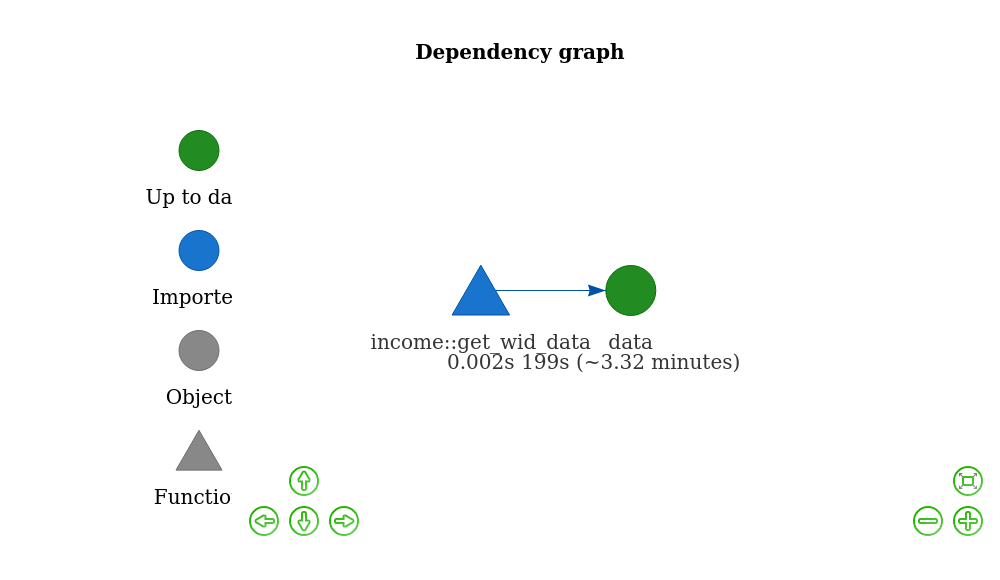
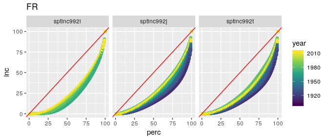

<!-- README.md is generated from README.Rmd. Please edit that file -->
Income
======

The goal of income is to visualise income data of countries through plotting Lorenz-Curves.

Installation
------------

You can install this package with:

``` r
devtools::install_github("m-g-h/income")
```

Example
=======

This package is implemented via the package `drake` and should only be used inside an R-Project. After setting one up, do the following:

1 "Make" the drake plan:
------------------------

``` r
income::make_project()
```

You can take a look at the drake-plan with:

``` r
income::show_project()
```

 *(it's quite simple)*

2 Plot the income distributions:
--------------------------------

``` r
income::plot_lorenz(ctry = "FR")
```



A list of the country id's can be shown with the function `country_list()`
